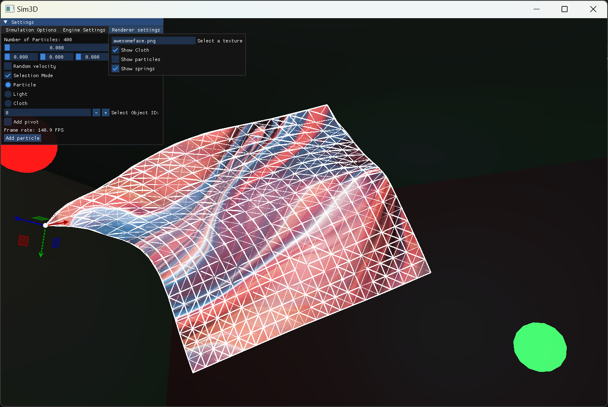
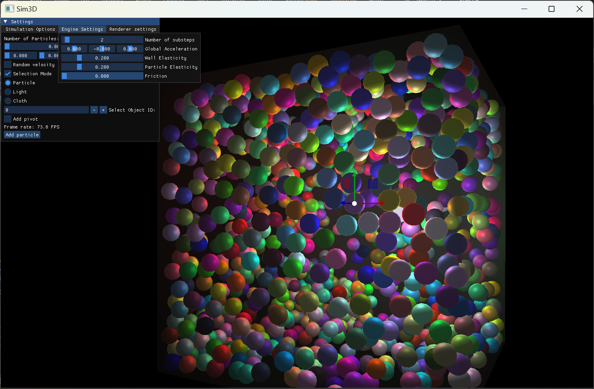
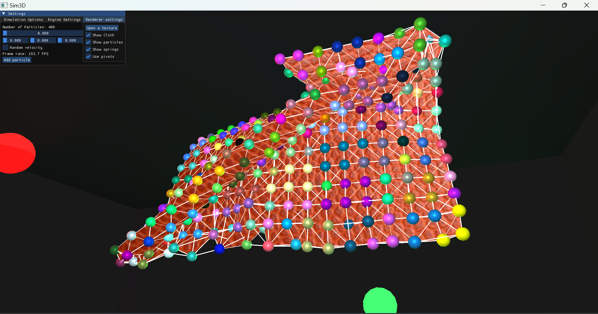

# Sim3D





Welcome to Sim3D! 
This is the successor to Sim2D which was written in Java and Processing.
This engine is designed to simulate particles in a 3D environment using OpenGL and C++. It allows for particle collision and movement, and includes a scene editor for setting up simulation parameters.

## Project Overview

The primary purpose of this particle simulation engine is to create particle simulations in C++ using OpenGL from scratch as much as possible, without relying on third-party libraries. The particles are represented as spheres and can interact with each other and with walls. The final goal is to add physics features like constraints, springs, etc., to turn it into a cloth simulation.

## Key Features

- Particle collision and movement
- Scene editor for setting up simulation parameters
- Different types of advanced lighting methods (currently includes Phong)
- GUI for the scene editor (using Dear ImGui and ImGuizmo)

## Prerequisites

To run the engine, you will need:
- OpenGL version 3
- C++ compiler
- Git
- vcpkg package manager
- Visual Studio (2019 or later recommended)

## Installation

### 1. Install Visual Studio

Download and install Visual Studio from the official Microsoft website:
[https://visualstudio.microsoft.com/downloads/](https://visualstudio.microsoft.com/downloads/)

Make sure to include the "Desktop development with C++" workload during installation.

### 2. Clone the Repository

```sh
git clone https://github.com/yourusername/sim3d.git
cd sim3d
```

### 3. Set Up vcpkg

If you haven't installed vcpkg yet, follow these steps:

```sh
git clone https://github.com/microsoft/vcpkg.git
cd vcpkg
.\bootstrap-vcpkg.bat
.\vcpkg integrate install
```

### 4. Install Dependencies

Use vcpkg to install ImGuizmo:

```sh
.\vcpkg install imguizmo
```

### 5. Build the Project

Ensuring that your project is configured to use the vcpkg toolchain file, you can either build it using visual studio, or MSbuild

## Option 1 : Build in Visual Studio

To run the simulation:
1. Compile and run the `main.cpp` file.
2. Set the engine state parameters (number of particles, their positions, wall positions, velocities, gravity, etc.) directly in the `main.cpp` file or use the scene editor. 

## Option 2 : Build using MSbuild

1. Install [Visual Studio Build Tools for C++](https://visualstudio.microsoft.com/visual-cpp-build-tools/)
2. Open "Developer Command prompt for VS"
3. Run these commands
```sh
msbuild path\to\sim3d\sim3d.sln /p:Configuration=Release
cd path\to\sim3d
copy .\x64\Release\sim3d.exe .\sim3d\
.\sim3d\sim3d.exe
```

## Usage

Use the following keyboard controls during simulation:
   - **WASD**: Camera movement
   - **Left Shift**: Toggle cursor visibility to interact with the GUI
   - **Space**: Move camera up
   - **Left Ctrl**: Move camera down
   - **Enter**: Play/pause simulation
   - If you are in selection mode, you can use the arrow keys to select the object, and more it around with gizmos


## Dependencies

The following dependencies are included in the `src/include` directory:
- GLM
- GLAD
- GLFW
- Dear ImGui

ImGuizmo is installed and managed through vcpkg.

## Contact

If you have any questions, suggestions, or issues, feel free to contact [anmolagrawal5704@gmail.com](mailto:anmolagrawal5704@gmail.com).
